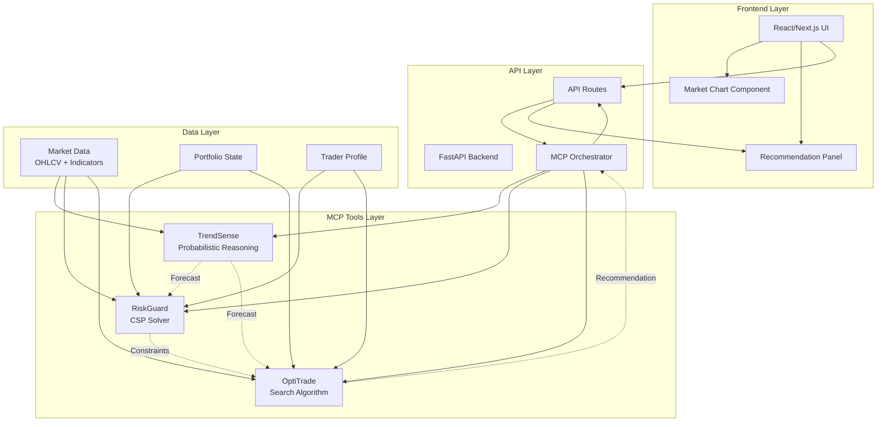
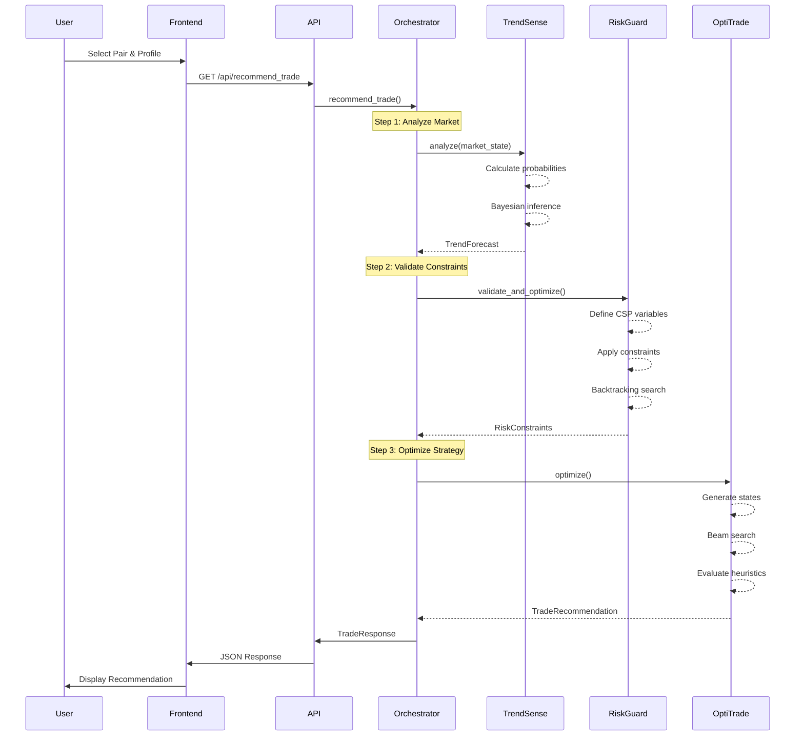
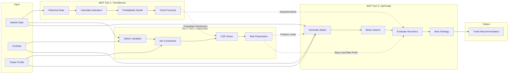
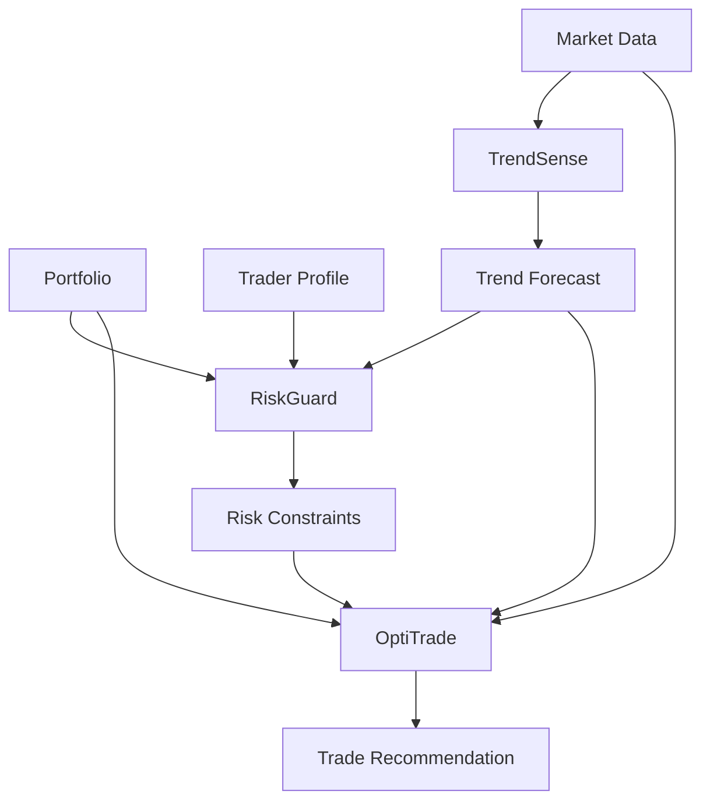
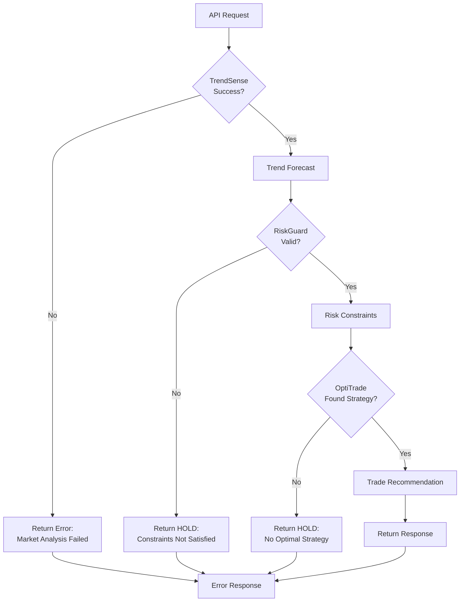
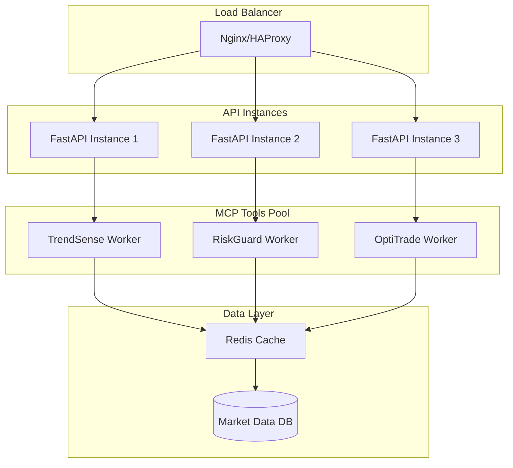

# ForexFlow Architecture

## High-Level System Architecture



## Data Flow Diagram



## MCP Coordination Pipeline



## TrendSense → RiskGuard → OptiTrade Pipeline

```mermaid
graph LR
    subgraph "Stage 1: TrendSense"
        direction TB
        I1[Market State Input]
        P1[Calculate Returns]
        P2[Calculate Volatility]
        P3[Moving Averages]
        P4[Probabilistic Model]
        O1[Trend Forecast Output]
        
        I1 --> P1
        I1 --> P2
        I1 --> P3
        P1 --> P4
        P2 --> P4
        P3 --> P4
        P4 --> O1
    end
    
    subgraph "Stage 2: RiskGuard"
        direction TB
        I2[Trend Forecast + Profile]
        C1[Max Risk Constraint]
        C2[Leverage Constraint]
        C3[Risk/Reward Constraint]
        C4[Capital Constraint]
        S1[CSP Solver]
        O2[Risk Parameters Output]
        
        I2 --> C1
        I2 --> C2
        I2 --> C3
        I2 --> C4
        C1 --> S1
        C2 --> S1
        C3 --> S1
        C4 --> S1
        S1 --> O2
    end
    
    subgraph "Stage 3: OptiTrade"
        direction TB
        I3[Forecast + Constraints]
        S2[Generate Candidate States]
        S3[Beam Search]
        S4[Heuristic Evaluation]
        S5[Select Best State]
        O3[Trade Recommendation]
        
        I3 --> S2
        S2 --> S3
        S3 --> S4
        S4 --> S5
        S5 --> O3
    end
    
    O1 -->|probability_up<br/>probability_down<br/>confidence<br/>expected_move| I2
    O2 -->|max_position_size<br/>stop_loss<br/>take_profit<br/>leverage| I3
```



## Detailed Component Interactions

### 1. TrendSense (Probabilistic Reasoning)

**Input:**
- Market State (OHLCV data, indicators)
- Historical price data (sliding window)

**Processing:**
- Calculate technical indicators (SMA, volatility, returns)
- Apply probabilistic model (Bayesian inference)
- Compute probability distribution over trends

**Output:**
```python
TrendForecast {
    direction: "bullish" | "bearish" | "neutral"
    confidence: 0.0 - 1.0
    probability_up: 0.0 - 1.0
    probability_down: 0.0 - 1.0
    probability_neutral: 0.0 - 1.0
    expected_move: float
    uncertainty_score: 0.0 - 1.0
}
```

### 2. RiskGuard (Constraint Satisfaction)

**Input:**
- TrendForecast from TrendSense
- Portfolio state (capital, positions)
- Trader profile (conservative/balanced/aggressive)

**Processing:**
- Define CSP variables (position_size, stop_loss, take_profit, leverage)
- Apply constraints based on trader profile
- Solve using backtracking search with domain filtering

**Output:**
```python
RiskConstraints {
    max_position_size: float
    stop_loss: float
    take_profit: float
    leverage: float
    risk_amount: float
    is_valid: boolean
    constraint_violations: list[str]
}
```

### 3. OptiTrade (Search-Based Optimization)

**Input:**
- TrendForecast from TrendSense
- RiskConstraints from RiskGuard
- Market state
- Portfolio state

**Processing:**
- Generate initial search states (BUY/SELL/HOLD)
- Apply beam search to explore candidate strategies
- Evaluate states using heuristic function:
  - Expected profit (from trend probabilities)
  - Risk-reward ratio
  - Trend alignment
  - Confidence score

**Output:**
```python
TradeRecommendation {
    action: "buy" | "sell" | "hold"
    entry_price: float
    position_size: float
    stop_loss: float
    take_profit: float
    leverage: float
    expected_profit: float
    risk_reward_ratio: float
    confidence_score: 0.0 - 1.0
    reasoning: str
}
```

## Classical AI Concepts Mapping

| MCP Tool | AI Concept | Implementation |
|----------|-----------|----------------|
| **TrendSense** | Probabilistic Reasoning | Bayesian inference, probability distributions, uncertainty quantification |
| **RiskGuard** | Constraint Satisfaction | CSP variables, domain filtering, backtracking search, constraint propagation |
| **OptiTrade** | Search Algorithms | State space representation, beam search, greedy best-first, heuristic evaluation |

## Data Dependencies



## Error Handling Flow



## Performance Considerations

### TrendSense
- **Complexity**: O(n) where n = sliding window size
- **Optimization**: Cache indicator calculations
- **Bottleneck**: Historical data processing

### RiskGuard
- **Complexity**: O(d^v) where d = domain size, v = variables
- **Optimization**: Forward checking, arc consistency
- **Bottleneck**: CSP solver with many constraints

### OptiTrade
- **Complexity**: O(b^d) where b = beam width, d = search depth
- **Optimization**: Limit beam width, prune low-scoring states
- **Bottleneck**: State evaluation with complex heuristics

## Scalability Architecture



## Future Enhancements

1. **Parallel MCP Execution**: Run TrendSense, RiskGuard, OptiTrade concurrently
2. **Caching Layer**: Cache market data and indicator calculations
3. **Real-time Updates**: WebSocket support for live recommendations
4. **Backtesting Engine**: Historical performance validation
5. **Multi-pair Analysis**: Portfolio-level optimization across pairs
6. **Advanced AI**: Deep learning for TrendSense, reinforcement learning for OptiTrade
